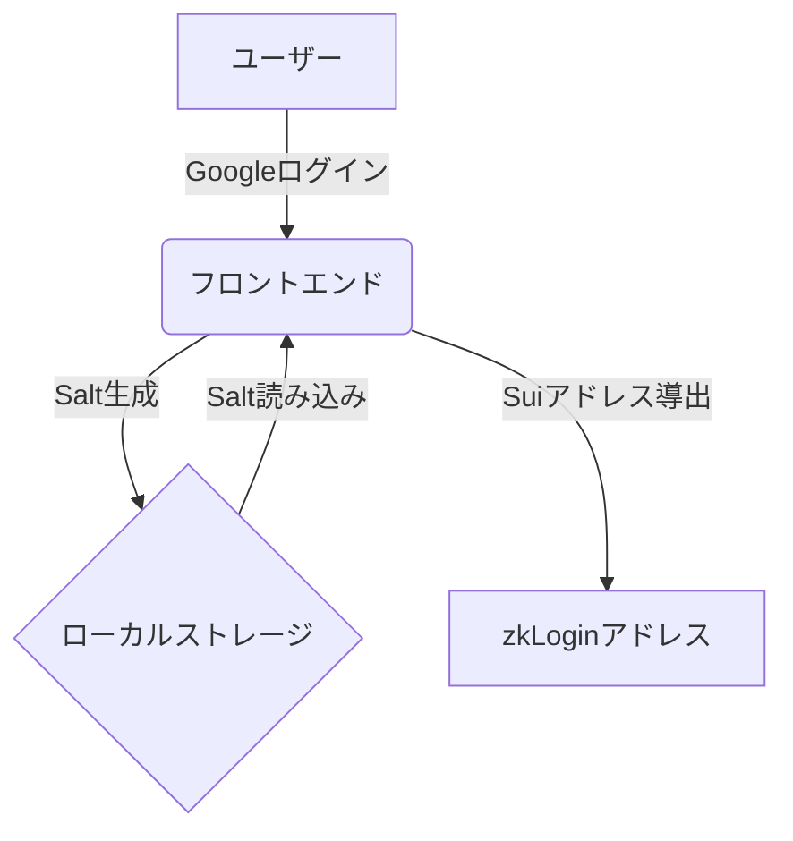
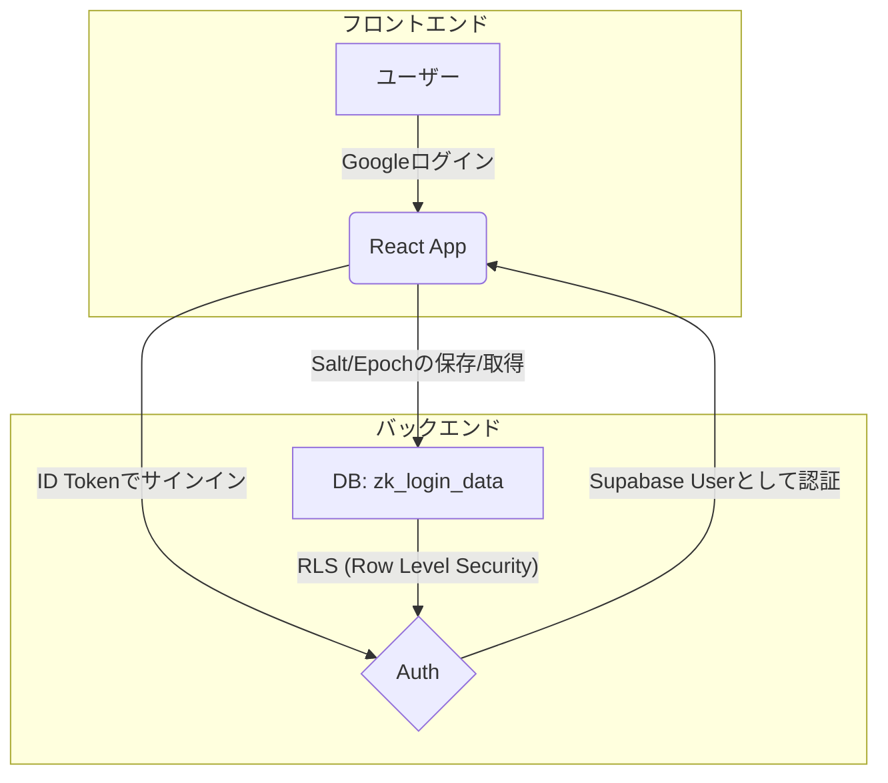

# Supabase導入によるzkLoginデータ永続化 詳細設計書

## 1. はじめに

### 1.1. 目的

本ドキュメントは、現在ローカルストレージに保存されているzkLogin関連のユーザーデータ（`userSalt`, `maxEpoch`）を、Supabaseのデータベースに移行するための詳細設計を定義する。

この変更により、ユーザーは異なるデバイスやブラウザからでも同じzkLoginアカウントにアクセスできるようになり、データの永続性と一貫性を確保する。

### 1.2. 背景

現状のアプリケーションでは、zkLoginの再ログイン時に同じSuiアドレスを導出するために必要な`userSalt`をブラウザのローカルストレージに保存している。この方法では、ユーザーがブラウザのキャッシュをクリアしたり、異なるデバイスを使用した場合にデータが失われ、同じアカウントを復元できなくなるという課題がある。

Supabaseをバックエンドとして導入し、これらのデータを永続化することで、UXを大幅に向上させる。

#### 現状のシステムフロー

このアプリケーションでは、大部分のロジックが src/context/GlobalProvider.tsx に集約されており、ReactのuseEffectフックを利用して、各
  ステップの処理が完了するたびに次の処理が自動的に連鎖して実行される仕組みになっています。

  処理フローの全体像

  全体の流れは、以下のようになります。

   1. ログイン準備: ユーザーがログインボタンを押すと、Suiネットワークとの通信に必要な一時的な情報を生成します。
   2. Google認証: 生成した情報を使ってGoogleに認証をリクエストします。
   3. 情報取得: Googleから返されたIDトークン（身分証明書）と、ユーザー固有のSalt（秘密の文字列）を取得します。
   4. アドレス導出: IDトークンとSaltから、ユーザーのSuiアドレスを計算します。
   5. 証明書取得: 実際にSui上で取引を行うための「ゼロ知識証明（ZK Proof）」を裏側で取得します。

  以下で各ステップを詳しく見ていきましょう。

  ---

  ステップ1: ログイン準備 (ユーザーの操作)

   1. ユーザーがUI上の「Sign In with Google」ボタンをクリックします。
   2. src/hooks/useZKLogin.ts の startLogin 関数が呼び出されます。
   3. この関数は、zkLoginのプロセスを開始するために、以下の3つの重要な情報を準備します。
       * 一時的な鍵ペア (Ephemeral KeyPair): このログインセッション中だけ有効な、使い捨ての鍵ペアです。毎回新しい鍵を使うことで、セキ
         ュリティを高めています。(generateEphemeralKeyPair)
       * 現在のエポック (Current Epoch): Suiブロックチェーンの現在の「時間」のようなものです。後で生成するNonce（後述）の有効期間を定
         めるために取得します。(fetchCurrentEpoch)
       * ランダムな値 (Randomness): Nonceを生成するための一時的な乱数です。(generateRandomnessValue)

  ステップ2: Googleへの認証リクエスト

   1. ステップ1で準備した3つの情報（一時鍵ペアの公開鍵, エポック,
      ランダムな値）が揃うと、GlobalProvider内のuseEffectがそれを検知します。
   2. これらの情報を使って Nonce (ノンス) という、一度しか使えない使い捨ての値を生成します (generateNonce)。
   3. このNonceは、「このログインリクエストは、たった今、このアプリから発行された正当なものである」ということを証明する役割を果たし、第
      三者が同じリクエストを再利用する「リプレイ攻撃」を防ぎます。
   4. 生成されたNonceを含んだ特別なURLが作成され、ユーザーは自動的にGoogleのログインページへリダイレクトされます。

  ステップ3: Googleからの応答と情報の取得

   1. ユーザーがGoogleアカウントで正常にログインすると、Googleはアプリケーション（REDIRECT_URIで指定されたURL）にユーザーを戻します。
   2. その際、URLのハッシュ部分 (#以降) に IDトークン (JWT) という、ユーザーの身分情報が入った一種の証明書が含まれています。
   3. アプリケーションはURLからこのIDトークンを抽出し、デコード（解読）してユーザー情報を取得します。
   4. 同時に、ユーザー固有の Salt (ソルト) を準備します。Saltは、ユーザーのSuiアドレスを生成するための一種の「秘密の味付け」です。この
      アプリケーションでは、localStorageに保存されたものを読み込むか、初回ログイン時に新しく生成しています。Saltがあることで、同じGoogl
      eアカウントでも利用するアプリごとに異なるSuiアドレスが生成され、プライバシーが保護されます。

  ステップ4: Suiアドレスの導出 ✨

   1. IDトークン と Salt という、最も重要な2つの情報が揃いました。
   2. GlobalProvider内の別のuseEffectがこれを検知し、@mysten/zkloginライブラリのjwtToAddress関数を呼び出します。
   3. この関数が、IDトークンとSaltを元に、ユーザーに紐づいた固有の Suiアドレス を計算します。
   4. この時点で、ユーザーはGoogleアカウントに紐づいた自分自身のSuiアドレスを画面上で確認できるようになります。

  ステップ5: ZK Proof (ゼロ知識証明) の取得 (バックグラウンド処理)

  Suiアドレスの導出とほぼ同時に、裏側では最後の仕上げが行われます。

   1. Suiブロックチェーン上で実際にトランザクション（例:
      コインの送付やNFTのミント）を実行するには、「このSuiアドレスの正当な所有者である」という証明が必要です。
   2. そのために、これまでに集めた全ての情報（IDトークン、一時鍵ペア、Saltなど）を、Mysten Labsが提供する Prover (証明サーバー)
      という外部サービスに送信します。
   3. Proverは、これらの情報が正当であることを検証し、ユーザーの個人情報（名前やメールアドレスなど）を一切明かすことなく、「確かに本人
      が操作している」という事実だけを数学的に証明するデータ、ZK Proof (ゼロ知識証明) を生成して返します。
   4. このZK ProofはアプリケーションのStateに保存され、ユーザーがトランザクションを実行する際にSuiネットワークへ送られます。

  ---

  まとめ

  このように、一見シンプルなGoogleログインの裏側では、セキュリティとプライバシーを確保するための複数のステップがuseEffectによって連
  携し、自動的に実行されています。

  フローを簡略化すると以下のようになります。

   1 1. [ユーザー]  -> "Sign In"ボタンをクリック
   2 2. [アプリ]    ->  ログイン準備 (一時鍵ペア, エポック, ランダム値)
   3 3. [アプリ]    ->  ↑からNonceを生成
   4 4. [アプリ]    ->  Google認証画面へリダイレクト (Nonce付き)
   5 5. [ユーザー]  ->  Googleでログイン
   6 6. [Google]   ->  アプリへリダイレクト (IDトークン付き)
   7 7. [アプリ]    ->  IDトークンとSaltを取得
   8 8. [アプリ]    ->  IDトークンとSaltからSuiアドレスを導出 ✨
   9 9. [アプリ]    ->  (裏側で) Mysten ProverからZK Proofを取得

  以上が、このzkLoginデモアプリにおけるログインからSuiアドレス導出までの処理フローの解説です。

### 1.3. 成果物

- Supabaseを利用した新しいアーキテクチャの定義
- 改修後のフォルダ構造
- データベースのテーブル設計
- 認証フローの変更点の定義
- フロントエンドアプリケーションの改修方針
- 実装タスクの分割案

## 2. アーキテクチャ

### 2.1. 現状のアーキテクチャ



- **データフロー**:
    1. ユーザーがGoogleアカウントでログインする。
    2. 初回ログイン時、フロントエンドはランダムな`userSalt`を生成し、ローカルストレージに保存する。
    3. `userSalt`とGoogleから受け取ったJWTを元に、zkLoginアドレス（Suiアドレス）を導出する。
    4. 次回以降のログインでは、ローカルストレージから`userSalt`を読み込んでアドレスを再現する。

- **課題**:
    - データが単一のブラウザにロックインされる。
    - ユーザーによるデータ削除のリスクがある。

### 2.2. 提案するアーキテクチャ



- **データフロー**:
    1. ユーザーがGoogleアカウントでログインし、フロントエンドはGoogleから`id_token`を受け取る。
    2. フロントエンドは`id_token`を使い、`supabase.auth.signInWithIdToken()`を呼び出してSupabaseにサインインする。
    3. Supabaseはユーザーを認証し、セッション（JWT）をフロントエンドに返す。
    4. フロントエンドは認証されたユーザーとして、Supabaseの`zk_login_data`テーブルにアクセスする。
    5. **初回ログイン時**: `userSalt`を生成し、現在の`epoch`から`maxEpoch`を計算して、SupabaseのDBに保存する。
    6. **次回以降のログイン時**: SupabaseのDBから`userSalt`と`maxEpoch`を読み込み、zkLoginアドレスを再現する。

- **利点**:
    - データがクラウドに安全に保存され、永続化される。
    - どのデバイスからログインしても、同じアカウントにアクセス可能になる。
    - Supabaseの認証とRLSにより、セキュリティが向上する。

### 2.3. 改修後のフォルダ構造

今回の改修により、以下のファイルが追加・変更されます。

```diff
 /Users/harukikondo/git/sui-zklogin-demo/
 ├───.env.example
+├───.env.local (VITE_SUPABASE_URL, VITE_SUPABASE_ANON_KEYを追記)
 ├───package.json (+ @supabase/supabase-js)
 └───src/
     ├───App.tsx
     ├───main.tsx
     ├───components/
     │   └───Header.tsx (ログイン/ログアウトボタンの追加で変更の可能性あり)
     ├───context/
-    │   └───GlobalProvider.tsx
+    │   └───GlobalProvider.tsx (Supabase連携ロジックに大幅変更)
     ├───hooks/
     │   └───...
     ├───lib/
-    │   └───suiClient.ts
+    │   ├───suiClient.ts
+    │   └───supabaseClient.ts (新規追加)
     └───...

```

- **新規追加**: `src/lib/supabaseClient.ts`
- **主な変更点**: `src/context/GlobalProvider.tsx`
- **その他**: `package.json`に依存関係が追加され、`.env.local`に新しい環境変数が設定されます。

## 3. データベース設計

Supabase内に以下のテーブルを1つ作成する。

- **テーブル名**: `zk_login_data`
- **説明**: zkLoginに必要なユーザー固有の情報を保存する。

| カラム名      | 型        | 説明                               | 制約 / 設定                     |
| :------------ | :-------- | :--------------------------------- | :------------------------------ |
| `id`          | `uuid`    | ユーザーID                         | Primary Key, `auth.users.id`への参照 |
| `encrypted_user_salt` | `text`    | ユーザー固有の暗号化されたソルト   | Not Null                        |
| `max_epoch`   | `integer` | nonce生成に使用する最大エポック    | Not Null, `CHECK (max_epoch > 0)` |
| `created_at`  | `timestamptz` | 作成日時                           | Not Null, `now()`               |
| `updated_at`  | `timestamptz` | 更新日時                           | Not Null, `now()`               |

### 3.1. Row Level Security (RLS)

`zk_login_data`テーブルに対してRLSを有効にし、以下のポリシーを設定する。これにより、ユーザーは自分自身のデータにしかアクセスできなくなる。

- **SELECTポリシー**:
  - `auth.uid() = id`
- **INSERTポリシー**:
  - `auth.uid() = id`
- **UPDATEポリシー**:
  - `auth.uid() = id`
- **DELETEポリシー**:
  - `auth.uid() = id`

### 3.2. インデックスの追加

`id`カラムにインデックスを追加することで、ユーザーIDによる検索性能を向上させる。

```sql
CREATE INDEX idx_zk_login_data_user_id ON zk_login_data(id);
```

### 3.3. セキュリティ設計: user_saltの暗号化

`user_salt`はzkLoginアドレスを導出するための秘密情報であり、データベースにプレーンテキストで保存することはセキュリティ上のリスクを伴う。SupabaseのAdmin権限を持つ者やデータベースが侵害された場合、全ユーザーのzkLoginが危険にさらされる可能性がある。

このリスクを軽減するため、`user_salt`はクライアントサイドで暗号化してからSupabaseに保存する。復号もクライアントサイドで行う。

**暗号化の鍵**: ユーザーが設定するPINまたはパスワードを暗号化の鍵として使用することを推奨する。

**フローの変更点**:
1.  **ユーザーへのPIN/パスワード要求**: アプリケーションは、ユーザーがzkLogin情報を永続化する際に、PINまたはパスワードの設定を要求するUIを追加する。
2.  **クライアントサイドでの暗号化**: `user_salt`を生成した後、ユーザーが設定したPIN/パスワードを使って暗号化する。この暗号化された`user_salt`を`encrypted_user_salt`としてSupabaseに保存する。
3.  **クライアントサイドでの復号**: アプリケーション起動時やログイン時に、Supabaseから`encrypted_user_salt`を取得し、ユーザーにPIN/パスワードの入力を求め、それを使って復号する。

**考慮事項**:
-   ユーザーが設定したPIN/パスワードは、アプリケーション側で保存しない。ユーザー自身が管理する。
-   PIN/パスワードを忘れた場合のリカバリーメカニズムは、本設計の範囲外とするが、別途検討が必要となる。

#### 3.3.1. `encrypt` メソッドの設計

-   **目的**: プレーンテキストの`user_salt`を、ユーザー提供のパスワード（PIN）を使用して暗号化する。
-   **アルゴリズム**: Web Crypto API を使用したAES-GCM (Advanced Encryption Standard - Galois/Counter Mode) を推奨する。認証付き暗号であり、データの機密性、完全性、認証性を保証する。
-   **鍵導出**: PBKDF2 (Password-Based Key Derivation Function 2) を使用して、ユーザーパスワードから強力な暗号化鍵を導出する。これにより、ブルートフォース攻撃や辞書攻撃に対する耐性を高める。
    -   **ソルト**: PBKDF2にはランダムなソルトを使用し、暗号文と一緒に保存する。
    -   **イテレーション**: 十分なイテレーション回数（例: 100,000回以上）を設定し、計算コストを高める。
-   **初期化ベクトル (IV)**: AES-GCMには一意のIV（Nonceとも呼ばれる）が必要。ランダムに生成し、暗号文と一緒に保存する。
-   **出力形式**: 暗号文、PBKDF2ソルト、IV、認証タグをBase64エンコードし、特定の区切り文字で結合した文字列として出力する。
    -   例: `Base64(PBKDF2_Salt).Base64(IV).Base64(Ciphertext).Base64(Auth_Tag)`

```typescript
// src/utils/crypto.ts (新規作成を想定)

const PBKDF2_ITERATIONS = 100000; // 推奨されるイテレーション回数
const AES_KEY_LENGTH = 256; // AES-256
const IV_LENGTH = 12; // AES-GCMでは12バイトが推奨
const PBKDF2_SALT_LENGTH = 16; // PBKDF2ソルトの長さ

// ArrayBufferをBase64文字列に変換
function arrayBufferToBase64(buffer: ArrayBuffer): string {
  return btoa(String.fromCharCode(...new Uint8Array(buffer)));
}

// Base64文字列をArrayBufferに変換
function base64ToArrayBuffer(base64: string): ArrayBuffer {
  const binary_string = atob(base64);
  const len = binary_string.length;
  const bytes = new Uint8Array(len);
  for (let i = 0; i < len; i++) {
    bytes[i] = binary_string.charCodeAt(i);
  }
  return bytes.buffer;
}

/**
 * user_saltをユーザーパスワードで暗号化する
 * @param plainText 暗号化するuser_salt
 * @param password ユーザーが設定したPIN/パスワード
 * @returns 暗号化された文字列 (PBKDF2_Salt.IV.Ciphertext.Auth_Tag のBase64結合)
 */
export async function encrypt(plainText: string, password: string): Promise<string> {
  const textEncoder = new TextEncoder();
  const data = textEncoder.encode(plainText);

  // PBKDF2ソルトを生成
  const pbkdf2Salt = window.crypto.getRandomValues(new Uint8Array(PBKDF2_SALT_LENGTH));

  // パスワードから鍵を導出
  const keyMaterial = await window.crypto.subtle.importKey(
    'raw',
    textEncoder.encode(password),
    { name: 'PBKDF2' },
    false,
    ['deriveBits', 'deriveKey'],
  );
  const key = await window.crypto.subtle.deriveKey(
    {
      name: 'PBKDF2',
      salt: pbkdf2Salt,
      iterations: PBKDF2_ITERATIONS,
      hash: 'SHA-256',
    },
    keyMaterial,
    { name: 'AES-GCM', length: AES_KEY_LENGTH },
    false,
    ['encrypt', 'decrypt'],
  );

  // IVを生成
  const iv = window.crypto.getRandomValues(new Uint8Array(IV_LENGTH));

  // 暗号化
  const encrypted = await window.crypto.subtle.encrypt(
    { name: 'AES-GCM', iv: iv },
    key,
    data,
  );

  // 暗号文と認証タグを分離
  const ciphertext = encrypted.slice(0, encrypted.byteLength - 16); // 最後の16バイトが認証タグ
  const authTag = encrypted.slice(encrypted.byteLength - 16);

  // 各要素をBase64エンコードして結合
  return `${arrayBufferToBase64(pbkdf2Salt)}.${arrayBufferToBase64(iv)}.${arrayBufferToBase64(ciphertext)}.${arrayBufferToBase64(authTag)}`;
}
```

#### 3.3.2. `decrypt` メソッドの設計

-   **目的**: 暗号化された`user_salt`文字列を、ユーザー提供のパスワード（PIN）を使用して復号する。
-   **処理フロー**: 暗号化された文字列をパースして、PBKDF2ソルト、IV、暗号文、認証タグを抽出する。抽出したPBKDF2ソルトとユーザーパスワードを使って暗号化時と同じ方法で鍵を導出し、AES-GCMで復号する。復号時に認証タグを検証し、データの改ざんがないことを確認する。

```typescript
// src/utils/crypto.ts (encrypt関数に続けて追記)

/**
 * 暗号化されたuser_saltをユーザーパスワードで復号する
 * @param encryptedString 暗号化された文字列
 * @param password ユーザーが設定したPIN/パスワード
 * @returns 復号されたuser_salt (プレーンテキスト)
 * @throws Error 復号に失敗した場合（パスワード間違い、データ改ざんなど）
 */
export async function decrypt(encryptedString: string, password: string): Promise<string> {
  const parts = encryptedString.split('.');
  if (parts.length !== 4) {
    throw new Error('Invalid encrypted string format');
  }

  const pbkdf2Salt = base64ToArrayBuffer(parts[0]);
  const iv = base64ToArrayBuffer(parts[1]);
  const ciphertext = base64ToArrayBuffer(parts[2]);
  const authTag = base64ToArrayBuffer(parts[3]);

  // パスワードから鍵を導出
  const textEncoder = new TextEncoder();
  const keyMaterial = await window.crypto.subtle.importKey(
    'raw',
    textEncoder.encode(password),
    { name: 'PBKDF2' },
    false,
    ['deriveBits', 'deriveKey'],
  );
  const key = await window.crypto.subtle.deriveKey(
    {
      name: 'PBKDF2',
      salt: pbkdf2Salt,
      iterations: PBKDF2_ITERATIONS,
      hash: 'SHA-256',
    },
    keyMaterial,
    { name: 'AES-GCM', length: AES_KEY_LENGTH },
    false,
    ['encrypt', 'decrypt'],
  );

  // 暗号文と認証タグを結合
  const encryptedData = new Uint8Array(ciphertext.byteLength + authTag.byteLength);
  encryptedData.set(new Uint8Array(ciphertext), 0);
  encryptedData.set(new Uint8Array(authTag), ciphertext.byteLength);

  // 復号
  const decrypted = await window.crypto.subtle.decrypt(
    { name: 'AES-GCM', iv: iv },
    key,
    encryptedData.buffer,
  );

  const textDecoder = new TextDecoder();
  return textDecoder.decode(decrypted);
}
```

## 4. 実装の詳細

### 4.1. ライブラリの追加

`npm`または`yarn`を使い、SupabaseのJavaScriptクライアントライブラリをインストールする。

```bash
npm install @supabase/supabase-js
```

### 4.2. Supabaseクライアントのセットアップ

1.  `.env.local`ファイルにSupabaseのプロジェクトURLとAnonキーを追加する。
    ```env
    VITE_SUPABASE_URL="YOUR_SUPABASE_URL"
    VITE_SUPABASE_ANON_KEY="YOUR_SUPABASE_ANON_KEY"
    ```

2.  `src/lib/supabaseClient.ts` を新規作成し、クライアントを初期化する。環境変数の存在チェックを強化する。

    ```typescript
    // src/lib/supabaseClient.ts
    import { createClient } from '@supabase/supabase-js';

    const requiredEnvVars = {
      VITE_SUPABASE_URL: import.meta.env.VITE_SUPABASE_URL,
      VITE_SUPABASE_ANON_KEY: import.meta.env.VITE_SUPABASE_ANON_KEY,
    };

    Object.entries(requiredEnvVars).forEach(([key, value]) => {
      if (!value) {
        throw new Error(`Environment variable ${key} is required but not defined`);
      }
    });

    export const supabase = createClient(
      requiredEnvVars.VITE_SUPABASE_URL,
      requiredEnvVars.VITE_SUPABASE_ANON_KEY,
    );
    ```

### 4.3. 認証フローの改修 (`src/context/GlobalProvider.tsx`)

`GlobalProvider`コンポーネントが認証とデータ管理の責務を負う。

#### 4.3.1. 新しいStateの追加

Supabaseのユーザーとセッション情報を管理するためのStateを追加する。

```typescript
import { User, Session } from '@supabase/supabase-js';

// ...

const [user, setUser] = useState<User | null>(null);
const [session, setSession] = useState<Session | null>(null);
const [loading, setLoading] = useState(true); // 認証状態のローディング
```

#### 4.3.2. 認証状態の監視

`useEffect`を使ってSupabaseの認証状態の変化を監視し、ユーザー情報を更新する。

```typescript
import { supabase } from '../lib/supabaseClient';

// ...

useEffect(() => {
  setLoading(true);
  const { data: { subscription } } = supabase.auth.onAuthStateChange(
    (_event, session) => {
      setSession(session);
      setUser(session?.user ?? null);
      setLoading(false);
    }
  );

  return () => {
    subscription.unsubscribe();
  };
}, []);
```

#### 4.3.3. GoogleログインとSupabaseサインイン

Google OAuthのコールバックで`id_token`を取得した後、Supabaseにサインインする処理を追加する。認証とzkLoginデータの初期化を分離する。

```typescript
// 既存の `useEffect` (oauthParamsを監視) 内に処理を追加
useEffect(() => {
  const handleGoogleLogin = async (idToken: string) => {
    try {
      // 1. Supabaseにサインイン
      const { data: authData, error } = await supabase.auth.signInWithIdToken({
        provider: 'google',
        token: idToken,
      });
      
      if (error) throw error;
      
      // 2. zkLoginデータの取得/生成は別の関数で処理
      // authData.user.id を使用してzkLoginデータを初期化
      // initializeZkLoginData(authData.user.id); // 後述の関数を呼び出す
      
    } catch (error) {
      console.error('Supabase sign-in error:', error);
      enqueueSnackbar(`Supabase sign-in failed: ${error.message}`, { variant: 'error' });
    }
  };

  if (oauthParams?.id_token && !session) {
    const idToken = oauthParams.id_token as string;
    handleGoogleLogin(idToken);
    // ... 既存のJWTデコード処理など
  }
}, [oauthParams, session]);

// zkLoginデータの初期化（取得または新規作成）関数
const initializeZkLoginData = async (userId: string) => {
  // ここでuser_saltの復号に必要なPIN/パスワードの入力をユーザーに求める
  const userPin = prompt("Please enter your PIN to decrypt your zkLogin data:");
  if (!userPin) {
    enqueueSnackbar("PIN is required to access zkLogin data.", { variant: 'error' });
    return;
  }

  try {
    const { encryptedUserSalt, maxEpoch } = await fetchZkLoginData(userId);

    let currentSalt = encryptedUserSalt;
    if (encryptedUserSalt) {
      // 復号処理
      currentSalt = decrypt(encryptedUserSalt, userPin); // decrypt関数は別途実装
    } else {
      // 初回ログインまたはデータなしの場合
      currentSalt = generateRandomness();
      const { epoch } = await suiClient.getLatestSuiSystemState();
      const newMaxEpoch = Number(epoch) + 10;

      // 暗号化処理
      const encryptedNewSalt = encrypt(currentSalt, userPin); // encrypt関数は別途実装
      await saveZkLoginData(userId, encryptedNewSalt, newMaxEpoch);
      setMaxEpoch(newMaxEpoch);
    }
    setUserSalt(currentSalt);

  } catch (error) {
    console.error('Failed to initialize zkLogin data:', error);
    enqueueSnackbar(`Failed to initialize zkLogin data: ${error.message}`, { variant: 'error' });
  }
};

// zkLoginデータをSupabaseから取得する関数
const fetchZkLoginData = async (userId: string): Promise<{ encryptedUserSalt: string; maxEpoch: number } | null> => {
  try {
    const { data, error } = await supabase
      .from('zk_login_data')
      .select('encrypted_user_salt, max_epoch')
      .eq('id', userId) // ユーザーIDでフィルタリング
      .single();

    if (error) {
      if (error.code === 'PGRST116') { // データなし
        return null;
      }
      throw new Error(`Database error: ${error.message}`);
    }

    return {
      encryptedUserSalt: data.encrypted_user_salt,
      maxEpoch: data.max_epoch
    };
  } catch (error) {
    console.error('Failed to fetch zkLogin data:', error);
    throw error; // エラーを再スローして呼び出し元で処理
  }
};

// zkLoginデータをSupabaseに保存/更新する関数
const saveZkLoginData = async (userId: string, encryptedSalt: string, maxEpoch: number) => {
  const { data, error } = await supabase
    .from('zk_login_data')
    .upsert({
      id: userId,
      encrypted_user_salt: encryptedSalt,
      max_epoch: maxEpoch,
    }, {
      onConflict: 'id', // idが競合した場合に更新
      ignoreDuplicates: false // 重複を無視しない
    });

  if (error) {
    console.error('Failed to save zkLogin data:', error);
    throw new Error(`Failed to save zkLogin data: ${error.message}`);
  }
};
```

#### 4.3.4. 既存関数の置き換え

- `generateUserSalt()`: この関数は不要になり、`initializeZkLoginData`内のロジックに統合される。
- `fetchCurrentEpoch()`: `maxEpoch`の更新が必要な場合、`saveZkLoginData`を呼び出してDBをアップデートする処理に変更する。
- `resetLocalState()`: `signOut()`メソッドに変更し、Supabaseからのサインアウト処理を実装する。

```typescript
const signOut = async () => {
  const { error } = await supabase.auth.signOut();
  if (error) {
    console.error('Sign out error', error);
    enqueueSnackbar(`Sign out failed: ${error.message}`, { variant: 'error' });
  }
  // stateのリセット
  resetState();
  // sessionStorageのクリア
  window.sessionStorage.clear();
  navigate('/');
};
```

### 4.4. 型定義の生成

SupabaseのテーブルスキーマからTypeScriptの型定義を自動生成することを推奨する。これにより、型安全なデータベース操作が可能になる。

1.  Supabase CLIをインストールする。
    ```bash
    npm install -g supabase-cli
    ```
2.  プロジェクトルートで以下のコマンドを実行し、`types/database.ts`に型定義を出力する。
    ```bash
    supabase gen types typescript --project-id "YOUR_SUPABASE_PROJECT_ID" --schema public > src/types/database.ts
    ```

生成される型定義の例 (`src/types/database.ts`):

```typescript
export type Json = string | number | boolean | null | { [key: string]: Json | undefined } | Json[];

export interface Database {
  public: {
    Tables: {
      zk_login_data: {
        Row: {
          created_at: string;
          encrypted_user_salt: string;
          id: string;
          max_epoch: number;
          updated_at: string;
        };
        Insert: {
          created_at?: string;
          encrypted_user_salt: string;
          id: string;
          max_epoch: number;
          updated_at?: string;
        };
        Update: {
          created_at?: string;
          encrypted_user_salt?: string;
          id?: string;
          max_epoch?: number;
          updated_at?: string;
        };
        Relationships: [
          {
            foreignKeyName: "zk_login_data_id_fkey";
            columns: ["id"];
            isOneToOne: true;
            referencedBy: [];
            references: ["users", "id"];
          },
        ];
      };
    };
    Views: {
      [_ in never]: never;
    };
    Functions: {
      [_ in never]: never;
    };
    Enums: {
      [_ in never]: never;
    };
    CompositeTypes: {
      [_ in never]: never;
    };
  };
}
```

### 4.5. 既存ユーザーのデータ移行

ローカルストレージに既存のzkLoginデータを持つユーザーのために、Supabaseへのデータ移行処理を実装する。

```typescript
// GlobalProvider.tsx 内、認証状態が確立された後に実行
const migrateFromLocalStorage = async (userId: string) => {
  const existingSalt = window.localStorage.getItem('USER_SALT_LOCAL_STORAGE_KEY');
  const existingMaxEpoch = window.localStorage.getItem('MAX_EPOCH_LOCAL_STORAGE_KEY');
  
  if (existingSalt && existingMaxEpoch) {
    // ユーザーにPIN/パスワードの入力を求め、既存のsaltを暗号化
    const userPin = prompt("Existing zkLogin data found. Please enter a PIN to encrypt and migrate your data:");
    if (!userPin) {
      enqueueSnackbar("PIN is required to migrate existing data.", { variant: 'warning' });
      return;
    }

    try {
      const encryptedSalt = encrypt(existingSalt, userPin); // encrypt関数は別途実装
      await saveZkLoginData(userId, encryptedSalt, parseInt(existingMaxEpoch));
      
      // 移行成功後、ローカルストレージをクリア
      window.localStorage.removeItem('USER_SALT_LOCAL_STORAGE_KEY');
      window.localStorage.removeItem('MAX_EPOCH_LOCAL_STORAGE_KEY');
      enqueueSnackbar("Existing zkLogin data migrated successfully!", { variant: 'success' });
    } catch (error) {
      console.error('Failed to migrate existing data:', error);
      enqueueSnackbar(`Failed to migrate existing data: ${error.message}`, { variant: 'error' });
    }
  }
};

// アプリケーションの初期ロード時、またはユーザー認証後に一度だけ呼び出す
useEffect(() => {
  if (user) {
    migrateFromLocalStorage(user.id);
  }
}, [user]);
```

## 5. 改訂版タスク分割案と工数見積もり

ユーザーからのレビューを反映し、セキュリティ強化、エラーハンドリング、データ移行、テスト、ドキュメント更新の工数を追加した。

1.  **環境構築 (1.0h)**
    -   Supabaseプロジェクトを作成する。
    -   `zk_login_data`テーブルとRLSポリシーをSQL Editorで設定する。
    -   `id`カラムにインデックスを追加する。
    -   Google認証プロバイダーを設定する。
    -   `.env.local`にSupabaseのキーを設定する。

2.  **ライブラリ導入とクライアント設定 (0.5h)**
    -   `@supabase/supabase-js`をインストールする。
    -   `src/lib/supabaseClient.ts`を作成し、環境変数チェックを強化する。

3.  **セキュリティ対策の実装 (2.0h)**
    -   `user_salt`の暗号化・復号ロジック（`encrypt`, `decrypt`関数）を実装する。
    -   ユーザーにPIN/パスワード入力を求めるUIを実装する。

4.  **認証フローの改修 (2.5h)**
    -   `GlobalProvider.tsx`にSupabaseの認証ロジックを追加する。
    -   `onAuthStateChange`リスナーを実装する。
    -   Google OAuthコールバックで`signInWithIdToken`を呼び出すように変更する。
    -   認証とzkLoginデータ初期化の責務を分離する（`handleGoogleLogin`, `initializeZkLoginData`）。

5.  **データ管理ロジックの実装 (2.5h)**
    -   認証後の`zk_login_data`テーブルからのデータ取得処理を実装する（`fetchZkLoginData`）。
    -   初回ログイン時のデータ作成・保存処理を実装する（`saveZkLoginData`）。
    -   `upsert`操作を使用してデータ競合を回避する。
    -   `localStorage`への参照をすべて削除し、Supabaseへの処理に置き換える。
    -   エラーハンドリングを強化する。

6.  **型定義の生成と適用 (0.5h)**
    -   Supabase CLIをインストールし、型定義を自動生成する。
    -   生成された型定義をコードに適用する。

7.  **既存ユーザーのデータ移行 (1.0h)**
    -   `migrateFromLocalStorage`関数を実装する。
    -   アプリケーション起動時に一度だけ実行されるロジックを組み込む。

8.  **UIの調整とテスト (1.0h)**
    -   ログイン/ログアウトボタンをヘッダーなどに追加する。
    -   認証状態に応じたUIの表示/非表示を制御する。
    -   一連のフロー（初回ログイン、再ログイン、ログアウト、データ移行）をテストする。
    -   エラーケースのテストも含む。

9.  **ドキュメント更新 (0.5h)**
    -   本設計書の内容を最終確認し、必要に応じて更新する。

---
**合計見積もり工数: 11.5時間**
-

## 6. 考慮事項

- **エラーハンドリング**: Supabase APIとの通信失敗（ネットワークエラー、サーバーエラー等）に対する堅牢なエラーハンドリングと、ユーザーへのフィードバック（Snackbar等）を実装する必要がある。
- **セキュリティ**: `.env.local`ファイルが`.gitignore`に含まれていることを再確認する。RLSポリシーは慎重に設定・テストする。
- **一時データの扱い**: `ephemeralKeyPair`や`randomness`など、セッション中のみ必要な一時データは、引き続き`sessionStorage`で管理するのが適切である。今回の変更範囲には含めない。
- **PIN/パスワードのリカバリー**: ユーザーがPIN/パスワードを忘れた場合のリカバリーメカニズムは、本設計の範囲外とするが、別途検討が必要となる。

## 7. 実装タスクリスト

### Step 1: 環境構築 (Estimated: 1.0h)
- [ ] Supabaseプロジェクトを作成する
- [ ] SupabaseダッシュボードでGoogle認証プロバイダーを設定する
- [ ] Supabase SQL Editorで`zk_login_data`テーブルを作成する（`encrypted_user_salt`カラム、`max_epoch`型変更）
- [ ] `zk_login_data`テーブルにRow Level Security (RLS)ポリシーを設定する
- [ ] `zk_login_data`テーブルの`id`カラムにインデックスを追加する (`CREATE INDEX idx_zk_login_data_user_id ON zk_login_data(id);`)
- [ ] プロジェクトに`.env.local`ファイルを作成し、SupabaseのURLとAnonキーを追記する

### Step 2: フロントエンド設定 (Estimated: 0.5h)
- [ ] `npm install @supabase/supabase-js` を実行する
- [ ] `src/lib/supabaseClient.ts`を作成し、Supabaseクライアントを初期化するコードと環境変数チェックを記述する

### Step 3: セキュリティ対策の実装 (Estimated: 2.0h)
- [ ] `user_salt`を暗号化・復号するためのユーティリティ関数（`encrypt`, `decrypt`）を実装する（例: `src/utils/crypto.ts`）
- [ ] ユーザーにPIN/パスワード入力を求めるUIコンポーネントを実装する

### Step 4: 認証フローの改修 (Estimated: 2.5h)
- [ ] `src/context/GlobalProvider.tsx`にSupabaseの`user`, `session` stateを追加する
- [ ] `supabase.auth.onAuthStateChange`を呼び出す`useEffect`を追加し、認証状態を監視する
- [ ] Googleログインのコールバック処理を変更し、`handleGoogleLogin`関数内で`supabase.auth.signInWithIdToken`を呼び出す
- [ ] 認証成功後、`initializeZkLoginData`関数を呼び出し、zkLoginデータの取得・生成・暗号化・保存を行う
- [ ] ログアウト処理を実装し、`supabase.auth.signOut`を呼び出す`signOut`関数を作成する

### Step 5: データ管理ロジックの実装 (Estimated: 2.5h)
- [ ] `fetchZkLoginData`関数を実装し、Supabaseから暗号化された`user_salt`と`max_epoch`を取得する（エラーハンドリング強化）
- [ ] `saveZkLoginData`関数を実装し、暗号化された`user_salt`と`max_epoch`をSupabaseに`upsert`する
- [ ] `localStorage`を参照しているすべてのコード (`getItem`, `setItem`, `removeItem`, `clear`) を削除し、Supabaseとの通信に置き換える

### Step 6: 型定義の生成と適用 (Estimated: 0.5h)
- [ ] Supabase CLIをインストールする
- [ ] `supabase gen types typescript`コマンドを実行し、`src/types/database.ts`に型定義を生成する
- [ ] 生成された型定義を`GlobalProvider.tsx`や関連ファイルに適用する

### Step 7: 既存ユーザーのデータ移行 (Estimated: 1.0h)
- [ ] `migrateFromLocalStorage`関数を実装する
- [ ] アプリケーションの初期ロード時、またはユーザー認証後に`migrateFromLocalStorage`を一度だけ呼び出すロジックを組み込む

### Step 8: UIの調整とテスト (Estimated: 1.0h)
- [ ] `src/components/Header.tsx`などに、認証状態（`session`の有無）に応じてログイン/ログアウトボタンを表示する
- [ ] 認証やデータ取得中のローディング状態をUIに反映させる
- [ ] PIN/パスワード入力を求めるUIを統合する
- [ ] **テストシナリオ1（初回ログイン）**: 新規ユーザーでログインし、PIN設定、`zk_login_data`に暗号化されたレコードが作成されることを確認する
- [ ] **テストシナリオ2（再ログイン）**: 同一ユーザーで再ログインし、PIN入力、同じ`user_salt`が復号され、同じzkLoginアドレスが復元されることを確認する
- [ ] **テストシナリオ3（ログアウト）**: ログアウトボタンをクリックし、セッションが破棄され、ログイン画面に戻ることを確認する
- [ ] **テストシナリオ4（データ移行）**: ローカルストレージにデータがある状態でログインし、PIN入力、データがSupabaseに移行され、ローカルストレージがクリアされることを確認する
- [ ] **テストシナリオ5（エラーケース）**: ネットワークエラー、PIN間違いなどのエラーケースをテストし、適切なエラーメッセージが表示されることを確認する

### Step 9: ドキュメント更新 (Estimated: 0.5h)
- [ ] 本設計書の内容を最終確認し、必要に応じて更新する
